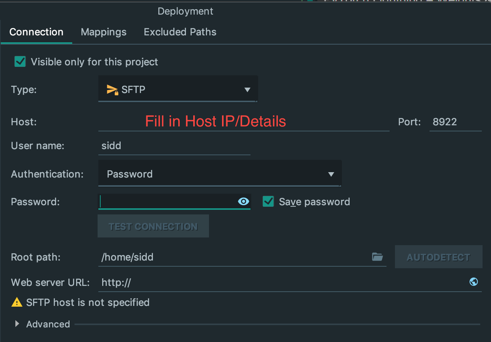
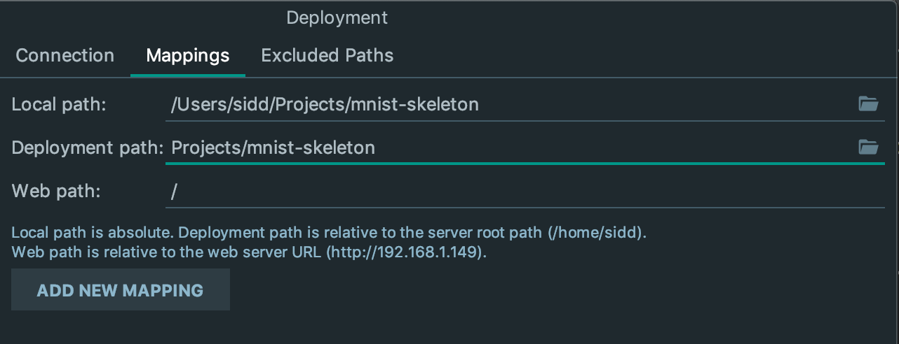
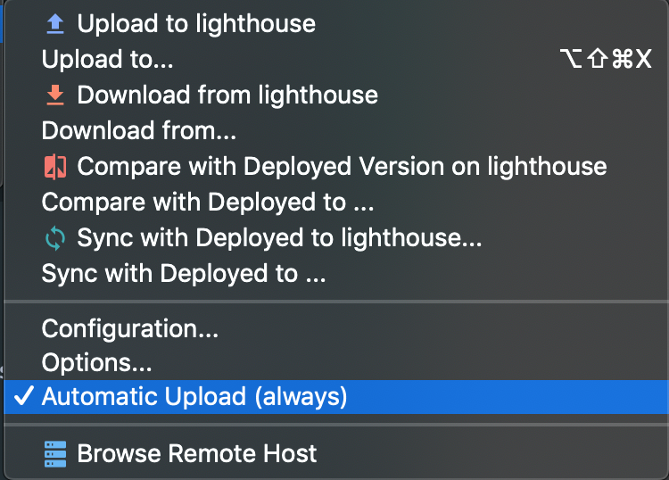

# MNIST Skeleton
Skeleton Repository implementing a simple MNIST example for new workflow --> PyTorch Lightning + Weights &amp; Biases

These instructions are for getting started with local development/on own Server (no cluster development)

The repository consists of the following components:

- `data/`: Path to data (either downloaded via a script in `scripts/` or via code in `src/`)

- `scripts/`: Directory of helpful bash scripts -- for example for downloading data to data directory
- `src/`: Code directory --> has top-level scripts for running and evaluating, and separate modules for pre-processing and models

- `wandb/`: Path to model checkpoints and other WandB logs

- `environment.yml`: Serialized Conda Environment for reproducibility

## Setup PyCharm Remote Development (to Dev Server --> Only if doing Remote Development)

First, connect to Host (Dev Server) nd specify given port (probably port 22 unless using custom setup like me):


Make sure to set up the deployment path on the remote machine!


Finally, set up sync commands to sync code (either automatically or on explicit Save action)


## Start-Up (from Scratch)

Use these commands if you're starting a repository from scratch (this is mostly for Sidd's use on starting brand-new 
projects using this repository as a base). If you're just trying to use this code, look at the following section.

```bash
# Create & Activate Conda Environment
conda create --name <REPO NAME> python=3.7
conda activate mnist-skeleton

# Install any libraries you care about -- e.g. PyTorch, Pytorch-Lightning, IPython & Jupyter

# Mac OS/Linux (if using GPU, make sure CUDA already installed)
conda install pytorch torchvision -c pytorch
pip install pytorch-lightning
conda install ipython jupyter 

# Go to Weights & Biases and Create New Project <REPO NAME>
# https://app.wandb.ai/home --> "New"
# Retrieve wandb hash: <HASH>

# Once created, run the following:
pip install --upgrade wandb
wandb login <HASH>                # Creates wandb/ directory
```

### Start-Up (Reproducibility)

